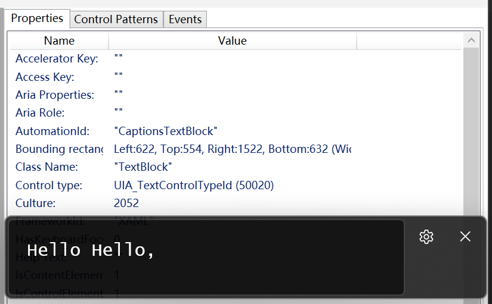

# get-livecaptions-rs
Get real time content of Windows System APP "Live Captions" [win+ctrl+L], write content into file. using rust, windows-rs

check slibing project [get-livecaptions-cpp](https://github.com/corbamico/get-livecaptions-cpp)

## Usage

```cmd
Usage: get-livecaptions.exe [OPTIONS] --file <FILE>

Options:
  -f, --file <FILE>          Name of the file to output
  -i, --interval <INTERVAL>  interval of minutes for one cycle [default: 3]
  -h, --help                 Print help
  -V, --version              Print version
```

## UIAutomation

To find the LiveCaptions GUI AutomationID, you may need tools as [inspect](https://learn.microsoft.com/en-us/windows/win32/winauto/inspect-objects), or [Automation-Spy](https://github.com/ddeltasolutions/Automation-Spy)



## License

Licensed under either of

 * Apache License, Version 2.0
   ([LICENSE-APACHE](LICENSE-APACHE) or http://www.apache.org/licenses/LICENSE-2.0)
 * MIT license
   ([LICENSE-MIT](LICENSE-MIT) or http://opensource.org/licenses/MIT)

at your option.

## Contribution

Unless you explicitly state otherwise, any contribution intentionally submitted
for inclusion in the work by you, as defined in the Apache-2.0 license, shall be
dual licensed as above, without any additional terms or conditions.

